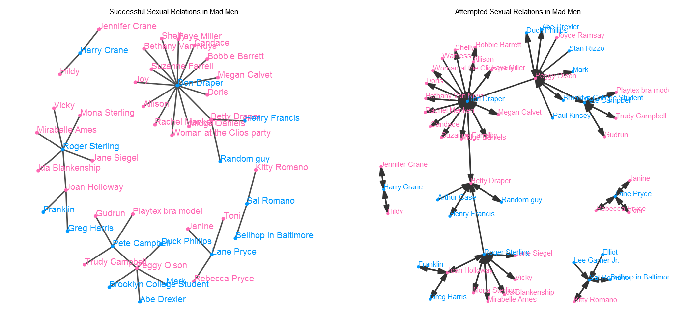

# datavisualization-001-HW2

class.coursera.org/datavisualization-001 :: Programming Assignment 2: Visualize Network Data

## Successful and Attempted Sexual Relations in Mad Men Visualized with geom_net()

Data: Winston Chang (2012). gcookbook: Data for "R Graphics Cookbook". R package version 1.0.
  http://CRAN.R-project.org/package=gcookbook
  
Code: Samantha Tyner @[sctyner/ggnet](https://github.com/sctyner/ggnet)
